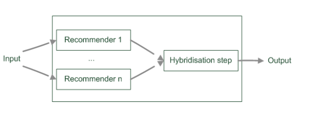
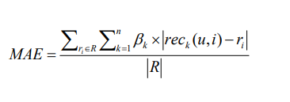

# Recommender System

This repo will be public

# Cold Start Problem

# CF

# Item-Item

# User-Item

# User-User

# LDA

# Ranking

# Tag 

# Category

# Trending

# Hybrid Approach 

## Parallelized hybridization design

- Output of several existing implementations combined
- Least invasive design
- Some weigting or voting schema
    - Weights can be learned dynamically
    - Extreme case of dynamic weighting is switching
    
    

    
**Weighted**

- But how to drive weights?
    - Estimate, e.g. by empirical bootstrapping
    - Dynamic adjustment of weights

- Empirical bootstrapping
    - Historical data is needed
    - Compute different weightings
    - Decide which one does best
    
- Dynamic adjustment of weights
    - Start with for instance uniform weight distribution
    - For each user adapt weights to minimize error of prediction
    
- Minimize MAE

# References

- http://ijcai13.org/files/tutorial_slides/td3.pdf

- [Hulu](https://web.archive.org/web/20170406065247/http://tech.hulu.com/blog/2011/09/19/recommendation-system.html)

- "System Architectures for Personalization and Recommendation" by Netflix Technology Blog https://link.medium.com/PaefDwO9bab

- https://github.com/mandeep147/Amazon-Product-Recommender-System

- https://github.com/smwitkowski/Amazon-Recommender-System

- Recommendation Systems: A Review https://towardsdatascience.com/recommendation-systems-a-review-d4592b6caf4b

- [Recommender system using Bayesian personalized ranking](https://towardsdatascience.com/recommender-system-using-bayesian-personalized-ranking-d30e98bba0b9)

- [Introduction to Recommender Systems in 2019](https://tryolabs.com/blog/introduction-to-recommender-systems/)

- [Introduction to recommender systems](https://towardsdatascience.com/introduction-to-recommender-systems-6c66cf15ada)

- https://en.wikipedia.org/wiki/Recommender_system#Mobile_recommender_systems

- Book: 推荐系统实践 项亮

- Book: Recommender systems:An introduction, Dietmar Jannach / Markus Zanker / Alexander Felfernig / Gerhard Friedrich, 2013

- [Robin Burke Recommender Systems: An Overview](https://www.researchgate.net/publication/220604600_Recommender_Systems_An_Overview)

- https://github.com/microsoft/recommenders

- https://github.com/kevinmcmahon/tagger

- https://github.com/timlyo/pyTag

- [Hybrid Recommendation Approaches](https://www.math.uci.edu/icamp/courses/math77b/lecture_12w/pdfs/Chapter%2005%20-%20Hybrid%20recommendation%20approaches.pdf)

- https://towardsdatascience.com/mixed-recommender-system-mf-matrix-factorization-with-item-similarity-based-cf-collaborative-544ddcedb330

- https://towardsdatascience.com/the-best-forecast-techniques-or-how-to-predict-from-time-series-data-967221811981

- [Trend or No Trend: A Novel Nonparametric Method for Classifying Time Series](https://dspace.mit.edu/handle/1721.1/85399)
